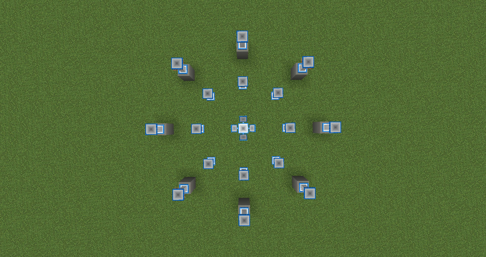
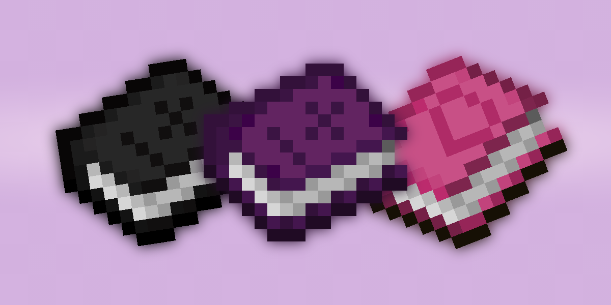

## azuma

azuma is a magical mod designed by Team Super People.

To get started, craft an azuma Guidebook by putting 1 book and quill into a crafting table, or use the one given to you when you first joined the world. The first quest will give you a hint on where to go first.

### Magical Crafting!

### Utility Items!

### Special Materials!

### Spells!

